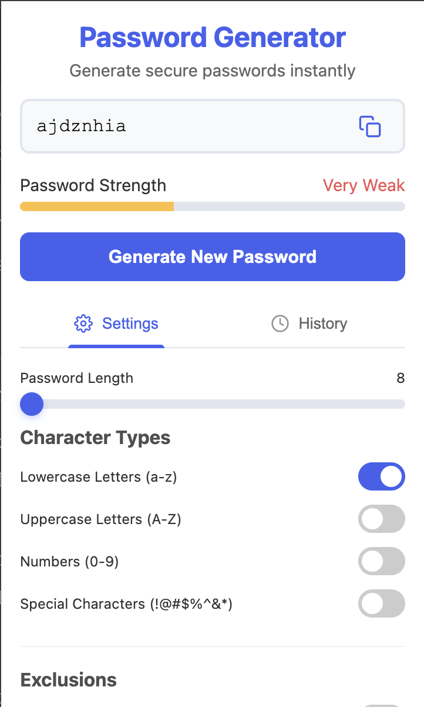

# Password Generator Chrome Extension

A powerful and secure browser extension for generating random passwords with customizable settings.

## Features

- Generate strong, random passwords instantly
- Customize password length (8-64 characters)
- Include/exclude character types:
  - Lowercase letters (a-z)
  - Uppercase letters (A-Z)
  - Numbers (0-9)
  - Special characters (!@#$%^&\*()\_+-=[]{}|;:,.<>?)
- Exclude similar characters (i, l, 1, L, o, 0, O)
- Exclude ambiguous characters ({ } [ ] / \ ' " ` ~)
- Password strength indicator
- Password history management
- Copy passwords to clipboard with one click

## Screenshots



## Why I Created This

I built this extension because I needed a reliable and secure way to generate strong passwords for my accounts. I no longer rely on passwords that I can memorize; instead, I use this generator to ensure my accounts are safe with complex passwords.

## Installation

### Chrome Web Store

_not available yet_

### Developer Mode Installation

To install the extension in developer mode:

1. Download or clone this repository to your local machine

   ```
   git clone https://github.com/justpiple/chrome-password-generator.git
   ```

2. Open Chrome and navigate to `chrome://extensions/`

3. Enable "Developer mode" by toggling the switch in the top right corner

4. Click "Load unpacked" and select the `src` directory containing the extension files

5. The Password Generator extension should now appear in your extensions list and be available in the toolbar

## Usage

1. Click the Password Generator icon in your browser toolbar
2. Adjust settings as needed (length, character types, exclusions)
3. Click "Generate New Password" to create a password
4. Click the copy icon to copy the password to your clipboard
5. View your password history in the History tab

## Security

This extension generates passwords locally within your browser. No passwords are sent to external servers. Your password history is stored in your browser's local storage and is accessible only to you on your current device.

## Development

### Project Structure

```
chrome-password-generator/
└── src/
    ├── background.js
    ├── icons/
    │   ├── icon16.png
    │   ├── icon32.png
    │   └── icon192.png
    ├── js/
    │   ├── passwordGenerator.js
    │   └── storage.js
    ├── manifest.json
    └── popup/
        ├── popup.css
        ├── popup.html
        └── popup.js

```

### Building from Source

No build process is required. The extension can be loaded directly in developer mode.

## License

This project is licensed under the MIT License - see the [LICENSE](LICENSE) file for details.

## Acknowledgments

- Icons provided by [Feather Icons](https://feathericons.com/)
