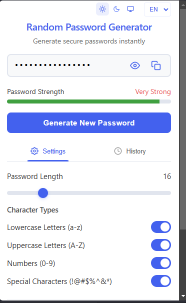

# Random Password Generator

A secure and feature-rich browser extension for generating strong, random passwords with advanced customization, history, and localization support.

## Features

- Instantly generate strong, random passwords (4–64 characters)
- Customize password length and character types:
  - Lowercase letters (a-z)
  - Uppercase letters (A-Z)
  - Numbers (0-9)
  - Special characters (!@#$%^&*)
- Exclude similar characters (i, l, 1, L, o, 0, O)
- Exclude ambiguous characters ({ } [ ] / \ ' " ` ~)
- Password strength indicator (with color and label)
- Password history (view, copy, delete, clear all)
- One-click copy to clipboard
- Toggle password visibility in history
- Fully localizable (English, Russian)
- Theme switcher: Light, Dark, System
- All data stored locally (privacy-friendly)
- Responsive, modern UI

## Screenshot




## Build & Installation

### Prerequisites
- Node.js & npm

### Build
1. Clone the repository:
   ```
   git clone https://github.com/NURGALIMOV/random-password-generator.git
   cd random-password-generator
   ```
2. Install dependencies:
   ```
   npm install
   ```
3. Build the extension:
   ```
   npm run build
   ```
   The production-ready extension will be in the `dist/` folder.

### Install in Chrome (Developer Mode)
1. Open Chrome and go to `chrome://extensions/`
2. Enable "Developer mode"
3. Click "Load unpacked" and select the `dist/` folder
4. The extension will appear in your browser

## Usage
1. Click the extension icon in your browser toolbar
2. Adjust password settings (length, character types, exclusions)
3. Click "Generate New Password" to create a password
4. Copy the password with one click
5. View, copy, or delete previous passwords in the History tab
6. Switch between Light, Dark, or System theme
7. Change interface language (EN/RU) in the popup

## Security
- All password generation and storage happens locally in your browser
- No data is sent to any external server
- Password history and settings are stored in browser local storage only
- Open source: you can audit the code

## Project Structure
```
random-password-generator/
├── dist/                # Production build (after npm run build)
├── src/                 # Source code
│   ├── background.js
│   ├── icons/           # Extension icons (various sizes)
│   ├── js/              # Core logic
│   │   ├── passwordGenerator.js
│   │   └── storage.js
│   ├── manifest.json
│   └── popup/
│       ├── popup.html
│       ├── popup.js
│       ├── popup.css
│       ├── i18n.js
│       ├── events.js
│       ├── ui.js
│       ├── history.js
│       ├── logger.js
│       ├── constants.js
│       ├── theme.js
│       ├── helpers.js
│       └── locales/
│           ├── en.js
│           └── ru.js
├── images/              # Screenshots
│   └── preview.png
├── package.json
├── webpack.config.js
├── README.md
└── LICENSE
```

## License

This project is licensed under the MIT License. See the [LICENSE](LICENSE) file for details.

## Manual Testing Checklist

- [ ] Extension loads in Chrome without errors
- [ ] Password is generated on button click
- [ ] Password length can be set from 4 to 64
- [ ] All character type toggles work (lowercase, uppercase, numbers, special)
- [ ] Exclude similar/ambiguous characters options work
- [ ] Password strength indicator updates correctly
- [ ] Password can be copied to clipboard
- [ ] Password history records generated passwords
- [ ] Passwords can be deleted from history
- [ ] "Clear All" deletes all history
- [ ] Password visibility toggle in history works
- [ ] Theme switcher (Light/Dark/System) works and persists
- [ ] Language switcher (EN/RU) works and persists
- [ ] All UI elements are localized (EN/RU)
- [ ] No data is sent to external servers (check network tab)
- [ ] All settings and history persist after browser restart
- [ ] Responsive layout (works on different window sizes)

---

**Enjoy secure password generation!**
